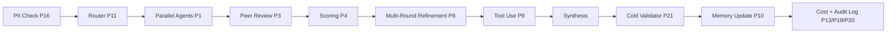

[ 📖 README ](./README.md) | [ 🗺️ ROADMAP ](./ROADMAP.md)

> Agent instruction: Implement phases sequentially from 1 to 21. Each phase depends on the previous. Do not skip, reorder, or ask for clarification — all required context is contained within each phase block.

# 🚀 AI Council Roadmap

This document outlines the 15-phase technical roadmap for the AI Council platform. The goals are prioritized based on implementation complexity and value to the deliberation quality.

---

## Current State vs Target State

Currently, the AI Council can take a user query, concurrently request opinions from multiple LLM agents, and synthesize those opinions into a final verdict. It streams the reasoning process and handles basic tool usage if configured, but lacks deep interactivity between the agents themselves.

When all 15 phases are complete, the Council will be a fully autonomous deliberation engine. Agents will critique and rank each other's responses over multiple rounds, guided by a deterministic scoring system and an independent validator, ensuring the highest possible fidelity and consensus before the user sees the final answer.

## Target Pipeline

## Progress Tracker

| Phase | Name | Milestone | Complexity | Status |
| :--- | :--- | :--- | :--- | :--- |
| 1 | Fix Parallel Execution | 1 | S | Not started |
| 2 | Introduce Structured Output Contract | 1 | M | Not started |
| 12 | Add Failure Isolation | 1 | S | Not started |
| 3 | Add Peer Review + Anonymized Ranking | 2 | M | Not started |
| 4 | Build Scoring Engine | 2 | M | Not started |
| 5 | Split Critic Into Multiple Roles | 2 | M | Not started |
| 6 | Implement Consensus Metric | 2 | M | Not started |
| 7 | Enable Cross-Agent Interaction | 2 | M | Not started |
| 8 | Add Multi-Round Refinement | 2 | M | Not started |
| 9 | Add Tool Execution Layer | 3 | L | Not started |
| 10 | Add Memory + Context System | 3 | L | Not started |
| 11 | Implement Router (Auto-Council) | 3 | L | Not started |
| 16 | PII Detection Pre-Send | 3 | S | Not started |
| 17 | Runtime-Editable Archetypes | 3 | M | Not started |
| 18 | Conversation Search | 3 | S | Not started |
| 19 | Audit Log | 3 | S | Not started |
| 13 | Add Token + Cost Tracking | 4 | S | Not started |
| 14 | Build Evaluation Framework | 4 | L | Not started |
| 15 | UI Enhancements | 4 | M | Not started |
| 20 | Real-Time Cost Ledger | 4 | S | Not started |
| 21 | Cold Validator / "Fresh Eyes" | 4 | M | Not started |

---

## Milestone 1 — Foundation
*Make what exists work correctly and at scale.*

## 🟢 PHASE 1 — FIX PARALLEL EXECUTION
**REQUIREMENTS:**
- All model calls execute concurrently
- Eliminate sequential awaits in loops
- SSE streams are independent per model

**IMPLEMENTATION NOTES:**
- **Files to change:** `src/lib/council.ts`
- **Actions:** Replace `mapConcurrent`'s internal limiting loop with native `Promise.all` for genuine parallel execution. Ensure `onMemberChunk` propagates the `model_id` to the SSE stream. Remove blocking logic inside the stream loop.
- **Complexity:** S

---

## 🟢 PHASE 2 — INTRODUCE STRUCTURED OUTPUT CONTRACT
**REQUIREMENTS:**
- All agents return strict JSON conforming to a schema (answer, reasoning, key_points, assumptions, confidence).

**IMPLEMENTATION NOTES:**
- **Files to change:** `src/lib/providers.ts`, `src/config/archetypes.ts`, `src/routes/ask.ts`
- **Actions:** Use Zod schemas on the backend to validate incoming agent chunks. Modify `systemPrompt` in `prepareCouncilMembers` to strictly request JSON. Handle retry logic in `askProvider` for schema violations.
- **Complexity:** M

---

## 🟡 PHASE 12 — ADD FAILURE ISOLATION
**REQUIREMENTS:**
- System must tolerate model failure (Timeout 8s, Quorum logic).

**IMPLEMENTATION NOTES:**
- **Files to change:** `src/lib/council.ts`
- **Actions:** Update `AbortSignal.timeout` in `deliberate` from 45s to 8s. Implement quorum checks (e.g., if valid responses < 2, throw or skip).
- **Complexity:** S

---

## Milestone 2 — Deliberation Engine
*Transform parallel responses into genuine multi-agent reasoning.*

## 🟡 PHASE 3 — ADD PEER REVIEW + ANONYMIZED RANKING
**REQUIREMENTS:**
- Agents evaluate each other anonymously, outputting a ranking and a critique.

**IMPLEMENTATION NOTES:**
- **Files to change:** `src/lib/council.ts`
- **Actions:** In multi-round loops, gather Round 1 outputs. Anonymize them (e.g., "Response A", "Response B"). Query each agent to provide a JSON response with `ranking` and `critique`.
- **Conflicts:** Requires adjusting the current `Critic` phase where only the Master model evaluates.
- **Complexity:** M

---

## 🟡 PHASE 4 — BUILD SCORING ENGINE
**REQUIREMENTS:**
- Deterministic evaluation independent of master model based on agreement, confidence, and peer ranking scores.

**IMPLEMENTATION NOTES:**
- **Files to change:** `src/lib/scoring.ts` (new file), `src/lib/council.ts`
- **Actions:** Create a deterministic scoring module. Apply formulas: `w1 * agreement + w2 * confidence + w3 * peer_ranking`. Filter responses based on the final score.
- **Complexity:** M

---

## 🟡 PHASE 5 — SPLIT CRITIC INTO MULTIPLE ROLES
**REQUIREMENTS:**
- Separate concerns: Critic (qualitative), Scorer (numeric), Controller (loop decision).

**IMPLEMENTATION NOTES:**
- **Files to change:** `src/lib/council.ts`, `src/config/archetypes.ts`
- **Actions:** In the `deliberate` function, replace the single Master Critic prompt with three distinct sequential operations. Controller decides to halt if `consensus_score > threshold`.
- **Complexity:** M

---

## 🟡 PHASE 6 — IMPLEMENT CONSENSUS METRIC
**REQUIREMENTS:**
- Deterministic convergence: Compute pairwise similarity, stop if consensus > 0.85 or max_rounds reached.

**IMPLEMENTATION NOTES:**
- **Files to change:** `src/lib/metrics.ts`, `src/lib/council.ts`
- **Actions:** Add pairwise similarity logic (potentially using a lightweight embedding comparison or Rouge/Bleu scores). Hook into the Controller logic from Phase 5.
- **Complexity:** M

---

## 🟠 PHASE 7 — ENABLE CROSS-AGENT INTERACTION
**REQUIREMENTS:**
- Agents must reference each other explicitly in prompts.

**IMPLEMENTATION NOTES:**
- **Files to change:** `src/lib/council.ts`
- **Actions:** In Round > 1, format the context so agents are prompted to "Respond to [Agent Name]'s claim." Remove anonymization for this specific interaction phase if it doesn't conflict with Phase 3 (Phase 3 is for ranking; Phase 7 is for direct critique).
- **Complexity:** M

---

## 🟠 PHASE 8 — ADD MULTI-ROUND REFINEMENT
**REQUIREMENTS:**
- At least 2 rounds: R1 (answers) -> R2 (critique + ranking) -> R3 (improved answers).

**IMPLEMENTATION NOTES:**
- **Files to change:** `src/lib/council.ts`
- **Actions:** Formalize the multi-round loop in `deliberate`. Currently, rounds simply append opinions and ask the Critic. This needs to be restructured into the R1/R2/R3 flow defined above.
- **Complexity:** M

---

## Milestone 3 — Intelligence & Memory
*Give agents tools, context, and autonomous routing.*

## 🔴 PHASE 9 — ADD TOOL EXECUTION LAYER
**REQUIREMENTS:**
- Agents can call tools (Code execution, Web search, Document parsing).

**IMPLEMENTATION NOTES:**
- **Files to change:** `src/lib/providers.ts`, `src/lib/tools/*` (new directory)
- **Actions:** Define a structured tool interface. Update `askProvider` and `askProviderStream` to handle `tool_calls` and `tool_choice`. Inject results back into the context array.
- **Complexity:** L

---

## 🔴 PHASE 10 — ADD MEMORY + CONTEXT SYSTEM
**REQUIREMENTS:**
- Stateful multi-turn interaction with short-term and long-term DB memory.

**IMPLEMENTATION NOTES:**
- **Files to change:** `src/routes/ask.ts`, `src/lib/history.ts`, `prisma/schema.prisma`
- **Actions:** Utilize Prisma to store not just raw chat, but summarized context embeddings. Potentially implement basic RAG via pgvector for context retrieval.
- **Complexity:** L

---

## 🔴 PHASE 11 — IMPLEMENT ROUTER (AUTO-COUNCIL)
**REQUIREMENTS:**
- Dynamic agent selection based on query type.

**IMPLEMENTATION NOTES:**
- **Files to change:** `src/lib/router.ts` (new file), `src/routes/ask.ts`
- **Actions:** Before execution, hit a fast, cheap model (e.g., Llama 3 8B) to classify the query. Map the classification to optimal archetype subsets and override user selection (or provide it as an "Auto" mode).
- **Complexity:** L

---

## 🟡 PHASE 16 — PII DETECTION PRE-SEND
**REQUIREMENTS:**
- Before any API call, scan user prompt for PII (email, phone, SSN, credit card, etc.). Surface UI warning with option to anonymize or proceed.

**IMPLEMENTATION NOTES:**
- **Files to change:** `src/lib/pii.ts` (new), `frontend/src/components/PiiWarning.tsx` (new)
- **Actions:** Implement PII scanning logic and surface warning in UI.
- **Complexity:** S

---

## 🟠 PHASE 17 — RUNTIME-EDITABLE ARCHETYPES
**REQUIREMENTS:**
- Expose archetype system prompts as user-editable JSON/YAML via UI, stored in DB per user.

**IMPLEMENTATION NOTES:**
- **Files to change:** `prisma/schema.prisma` (new Archetype model), `src/routes/archetypes.ts`, `frontend/src/components/ArchetypeEditor.tsx` (new)
- **Actions:** Add DB models and endpoints for user-editable archetypes, create UI editor component.
- **Complexity:** M

---

## 🟡 PHASE 18 — CONVERSATION SEARCH
**REQUIREMENTS:**
- Full-text search across past council sessions: query content, archetype names, verdict keywords. Prisma + PostgreSQL supports full-text search natively.

**IMPLEMENTATION NOTES:**
- **Files to change:** `src/routes/history.ts` (add search endpoint), `frontend/src/components/SearchDialog.tsx` (new)
- **Actions:** Add search endpoint using Prisma full-text search and create search UI component.
- **Complexity:** S

---

## 🟡 PHASE 19 — AUDIT LOG
**REQUIREMENTS:**
- Per-request log: full prompt sent to each model, full response received, timing. Viewable in UI alongside cost ledger.

**IMPLEMENTATION NOTES:**
- **Files to change:** `src/lib/audit.ts` (new), `prisma/schema.prisma` (new AuditLog model)
- **Actions:** Implement audit logging for all API calls and store in DB.
- **Complexity:** S

---

## Milestone 4 — Observability & Production
*Make the system transparent, measurable, and production-ready.*

## 🟡 PHASE 13 — ADD TOKEN + COST TRACKING
**REQUIREMENTS:**
- Per-request accounting and cost estimation.

**IMPLEMENTATION NOTES:**
- **Files to change:** `src/lib/providers.ts`, `src/lib/metrics.ts`, `prisma/schema.prisma`
- **Actions:** We already track `tokensUsed`. Add cost estimation logic per model ID (e.g., static cost table). Expose via `GET /api/metrics` and in the UI.
- **Complexity:** S

---

## 🔴 PHASE 14 — BUILD EVALUATION FRAMEWORK
**REQUIREMENTS:**
- Measure system performance: Benchmark dataset, metrics.

**IMPLEMENTATION NOTES:**
- **Files to change:** `tests/benchmarks/*` (new directory)
- **Actions:** Write an automated test suite that runs a benchmark dataset through the council and measures accuracy against expected outputs, consistency, latency, and cost.
- **Complexity:** L

---

## 🟡 PHASE 15 — UI ENHANCEMENTS
**REQUIREMENTS:**
- Side-by-side comparison, ranking visualization, consensus meter, critique visibility.

**IMPLEMENTATION NOTES:**
- **Files to change:** `frontend/src/components/*`
- **Actions:** Implement new React components that consume the new structured events (e.g., `ranking`, `critique`, `consensus_score`) emitted by the backend via SSE.
- **Complexity:** M

---

## 🟠 PHASE 20 — REAL-TIME COST LEDGER
**REQUIREMENTS:**
- Per-query: per-model token accounting (input + output), estimated cost, cumulative session total. Collapsible: compact summary (total + tokens + latency) expands to full per-model breakdown. Color tiers: green <$0.01, amber $0.01–$0.10, red >$0.10.

**IMPLEMENTATION NOTES:**
- **Files to change:** `src/lib/metrics.ts` (add cost table), `frontend/src/components/CostLedger.tsx` (new)
- **Actions:** Implement real-time token tracking and UI ledger.
- **Complexity:** S

---

## 🔴 PHASE 21 — COLD VALIDATOR / "FRESH EYES"
**REQUIREMENTS:**
- After final synthesis, route the verdict to a SEPARATE model with ZERO prior council context. That model validates cold: checks for errors, hallucinations, overconfidence. New SSE event type: `validator_result`.

**IMPLEMENTATION NOTES:**
- **Files to change:** `src/lib/council.ts` (add post-synthesis step)
- **Actions:** Add an independent validation step post-synthesis using a fresh model instance.
- **Complexity:** M

---

## §8 — TABBED PANE UI SPECIFICATION

A concrete UI design requirement for Phase 15 and the Platform Enhancements additions. Implement a tabbed results panel in the frontend that organizes the deliberation output into the following tabs:

### TAB 1 — "Council" (default active tab)
- All agent responses displayed as cards, one per council member
- Each card shows: agent name + archetype badge, response text (streaming, word-by-word via SSE), confidence score badge, key_points as bullet list, assumptions as collapsible section
- Cards are arranged in a responsive grid (2-col on desktop, 1-col on mobile)
- While streaming: show a pulsing indicator on the active card
- After streaming: show confidence score colored bar (green = high, amber = mid, red = low)

### TAB 2 — "Debate" (visible after Round 2 completes)
- Per-round timeline: Round 1 → Round 2 → Round 3 (if applicable)
- For each round: show each agent's critique of the others, with agent attribution
- Anonymized ranking results: "Response A ranked #1 by 3 agents"
- Cross-agent reference highlights: if Agent B referenced Agent A's claim, show a visual thread between their cards
- Consensus meter: horizontal progress bar showing current consensus score (0 → 0.85 target), updated each round

### TAB 3 — "Verdict"
- Master synthesis output, streaming in real-time
- Below synthesis: Cold Validator result (§7-B) — shown as a "Validator Note" card with green/amber/red status
- Scoring breakdown: table showing each agent's final_score components (agreement / confidence / peer_ranking)
- Which agents were included in synthesis (top-k) vs filtered out

### TAB 4 — "Cost & Audit"
- Cost Ledger (§7-A): per-model token usage + cost, cumulative total, color-coded tiers
- Latency breakdown: time-to-first-token and total time per model
- Audit Log (§7-F): collapsible per-agent sections showing exact prompt sent and raw response received
- Export button: download full audit log as JSON

### TAB 5 — "Config" (inline, no page nav)
- Active council template name + members list
- Per-member: archetype name, model assigned, role, editable system prompt (§7-D)
- Router classification result (§6 Phase 11): what query type was detected, which archetypes were auto-selected and why
- PII detection status: clean / warning (§7-C)

**Implementation Notes:**
- Use React tabs (shadcn/ui Tabs component or simple state-driven tab switcher).
- Tab bar is sticky at the top of the results panel.
- Tabs 2, 3, 4 are disabled/grayed until the relevant data is available.
- Entire tabbed panel is driven by SSE events.
- Files: `frontend/src/components/tabs/`, `frontend/src/types/events.ts`